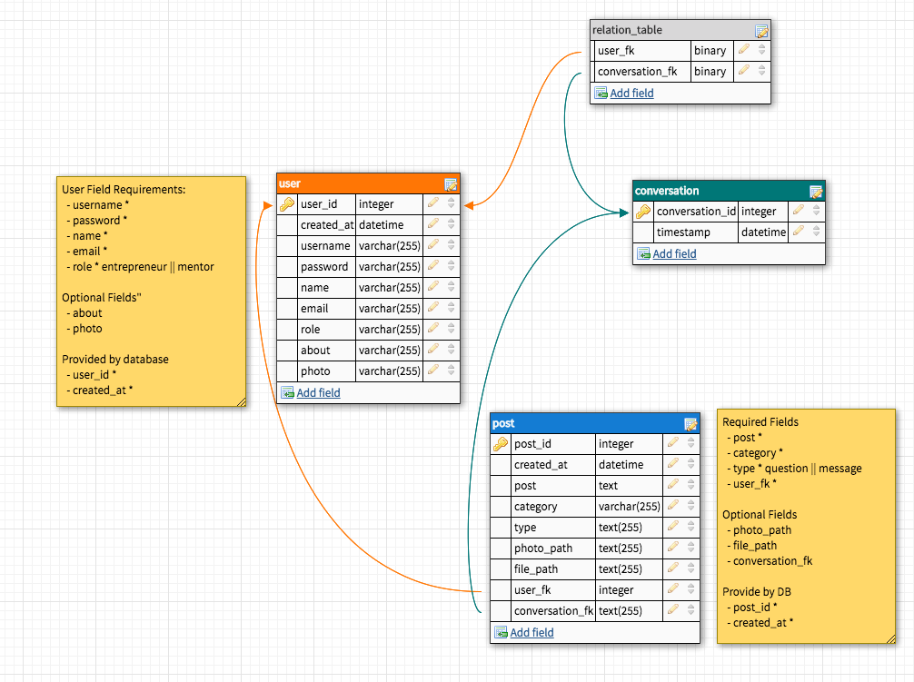

# Mentor Me - Back End

Mentor me app let entrepreneurs who are just starting out or small business owners to ask for advices or guidances on various business topics from (qualified) business professionals working in the industries for free.

- Designed by Alex King https://github.com/alex-ak

## Technology Used

- Server: Node.js | Express
- Authentication: Bcrypt & JWT.
- Database Builder: Knex.js
- Testing Database: Jest | Supertest | SQLite3
- Production & Development Database: PostgreSQL
- Package management: yarn

## Getting Started

These instructions will get you a copy of the project up and running on your local machine for development and testing purposes.

- Clone github repository onto your local machine
- Change directory into project folder.
- Run yarn `yarn install`
- Start server `yarn server`

## Add environment variables - example .env template

```
DATABASE_URL=connect to personal database
SECRET=input your secret for password hashing here
DB_ENV=development
PORT=4000
```

# Database Schema



# RESTful API Endpoints

## User Endpoints

### Register new user - POST

https://bw-mentor-me.herokuapp.com/api/register

```
Argument
  {
    "username": "string",
    "password": "string",
    "name": "string",
    "email": "string",
    "role": "string",
    "photo": "string", // optional
  }
```

```
Return
{
"message": "Registration successful",
"user_id": number,
"token": “abcd"
}
```

### Login existing user - POST

https://bw-mentor-me.herokuapp.com/api/login

```
Arguments
  {
    "username": “string",
    "password": “string"
  }
```

```
Return
  {
    "message": "Registration successful",
    "user_id": number,
    "token": “abcd"
  }

  Database generates id and timestamp.
```

### Get all users - GET - RESTRICTED

https://bw-mentor-me.herokuapp.com/api/users

```
Return
  [
    {
      "user_id": number,
      "username": “string",
      "name": “string",
      "email": “string",
      "role": “string",
      "about": “string",
      "photo": “string"
    }, ...
  ]
```

### Get user by id - GET

https://bw-mentor-me.herokuapp.com/api/user/:id

```
Return
  {
    "user_id": number,
    "username": “string",
    "name": “string",
    "email": “string",
    "role": “string",
    "about": “string",
    "photo": “string"
  }
```

### Update user by id - PATCH

https://bw-mentor-me.herokuapp.com/api/user/:id

```
Optional Arguments
  {
    "username": "string",
    "name": "string",
    "email": "string",
    "role": "string",
    "about": "string",
    "photo": "string"
  }
```

## Delete user by id - DELETE - RESTRICTED

https://bw-mentor-me.herokuapp.com/api/user/:id

Note: cannot delete user if they have messages.

```
Return
  {
    "message": "User successfully deleted"
  }
```

## Posts Endpoints - question / message

### Get questions - GET

https://bw-mentor-me.herokuapp.com/api/questions

```
Return
  [
    {
      "post_id": number,
      "post": “string",
      "description": “string",
      "category": “string",
      "user_id": number,
      "name": “string",
      "photo": “string"
    }
  ]
```

### Add new post - POST

https://bw-mentor-me.herokuapp.com/api/posts

```
Argument
  {
    “post": “string",
    “description": “string”,
    “category”: “string"
    “type": “string”,
    “user_fk": number
    "photo_path": "string", // optional
    "file_path": "string" // optional
    "conversation_fk": number  // optional
  }

  Database generates id and timestamp.
```

### Add answer to question - POST

https://bw-mentor-me.herokuapp.com/api/answers

```
Argument
{
post: 'string',  // answer to question
category: 'string',
user_fk: number,  // user id who answers
question_fk: number,  // post id this answer relates to
}

Database generates id and timestamp.
```

```
Return:
{
    post_i": number,
    post: "string",
    category: "string",
    type: "string",
    name: "string",
    photo: "string"
}
```

### Get post by id - GET

https://bw-mentor-me.herokuapp.com/api/posts/:id

```
Return
{
    "post_id": number,
    "post": "string",
    "description": "string",
    "category": "string",
    "user_id": number,
    "name": "string",
    "photo": "string"
}
```

### Update post by id - PATCH

https://bw-mentor-me.herokuapp.com/api/posts/:id

```
Optional Arguments
  {
    "post": “string",
    "description": “string",
    "category": “string",
    "type": "string",
    "photo_path": “string",
    "file_path": “string"
  }
```

### Delete post by id - DELETE

https://bw-mentor-me.herokuapp.com/api/posts/:id

```
Return
    { deleted: id }
```

## Conversation Endpoints

### Get conversation between two users by conversation id - GET

https://bw-mentor-me.herokuapp.com/api/conversations/:id

```
Return
  [
      {
        "post_id": 1,
        "post": "What's the relationship between aperture and ISO?",
        "description": "extended question goes here",
        "category": "Photography",
        "type": "question",
        "conversation_fk": 1,
        "user_id": 1,
        "name": "Angello Lopez"
    },
    {
        "post_id": 4,
        "post": "message from mentor",
        "description": null, // will be null for non-question
        "category": "Photography",
        "type": "message",
        "conversation_fk": 1,
        "user_id": 4,
        "name": "Lucy Lee"
    }, ...
  ]
```

### Get conversation ids for a user by user id - GET

https://bw-mentor-me.herokuapp.com/api/conversation-list/:id

```
return
[
  number,
  number
]
```
